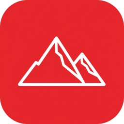
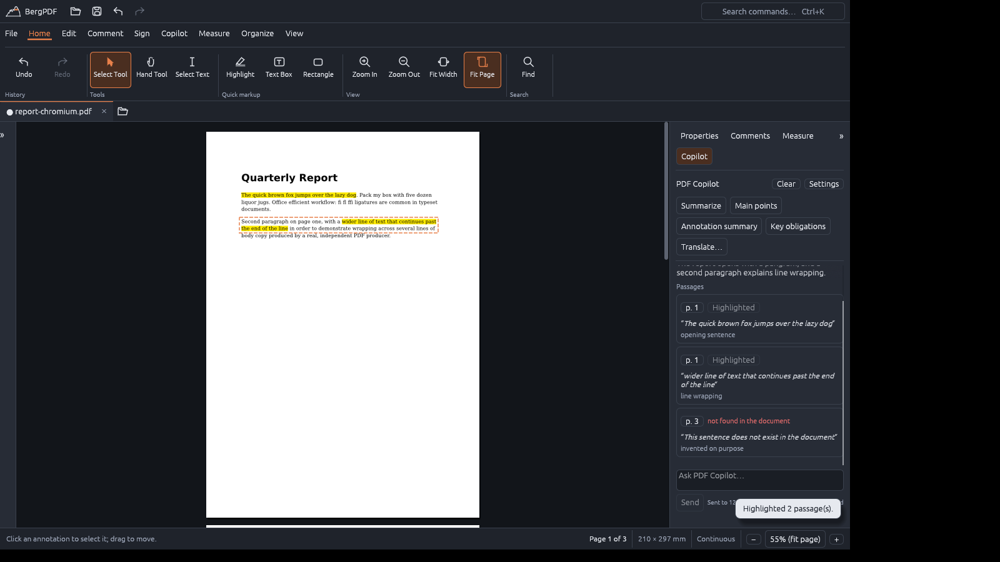
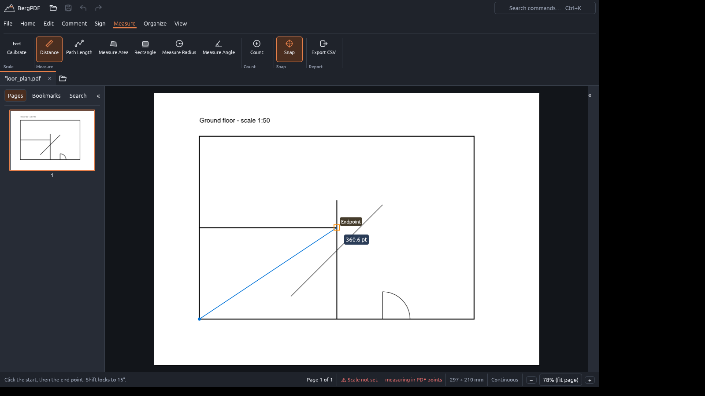
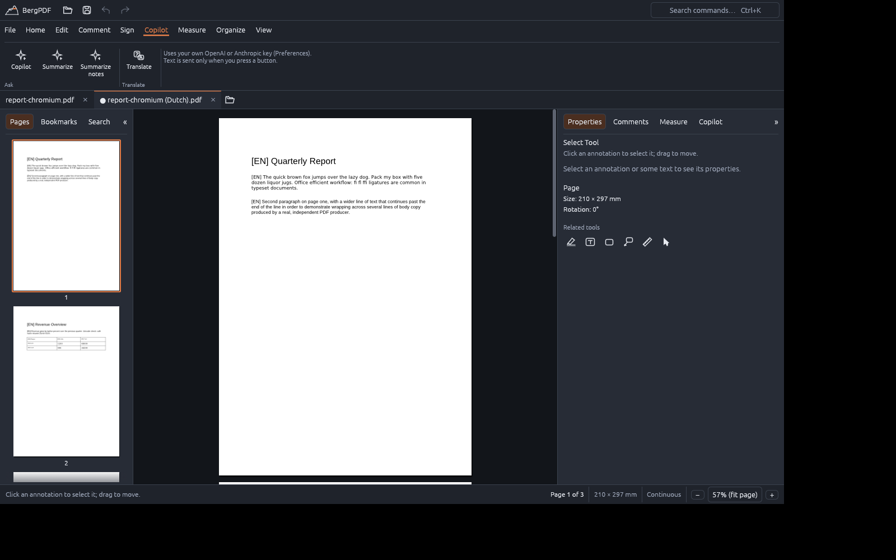

  

<h1 align="center">BergPDF</h1>

<b>A fast, private PDF editor for your desktop.</b> 
Edit, annotate, sign, measure, fill in forms and make scans searchable. Offline, no account, no tracking.

  <a href="../../releases">Download</a> ·
  <a href="#features">Features</a> ·
  <a href="#install">Install</a> ·
  <a href="DEVELOPING.md">Build it yourself</a> ·
  <a href="LICENSE">GPL-3.0</a>

## Why BergPDF

* **Your documents stay on your computer.** Everything core works offline. There is no account, no
  telemetry and no cloud. The optional AI features only send text when *you* press a button, to the provider
  you chose, with your own key.
* **Quick and light.** A native app written in Rust: pages render in tiles (built with large drawings in mind), and
  there is no browser engine or runtime to install.
* **Real editing, not just stamping.** Change existing text and images in place, add text in the fonts you
  have installed, reorganise pages, and keep every change undoable.
* **Free software.** GPLv3: you can read the source, build it yourself and share it.

## Features

**Read and navigate**
Tabs, thumbnails, bookmarks, links, full-text search, fit page / fit width / any zoom, single or continuous
pages, a dark page view, a command palette (Ctrl+K) and a right-click menu for what you can do right there.
Pictures (PNG, JPEG) open as one-page PDFs.
The interface is available in English, Dutch (Nederlands) and German (Deutsch); BergPDF follows your system
language, or you pick one in Preferences.

**Annotate**
Highlight, underline, strikeout, squiggly, sticky notes, text boxes, callouts (click the point, then place
the box), stamps, rectangles, ellipses, lines, arrows, polygons and freehand drawing, with colour, opacity,
line width and dash style. Text stays upright on rotated and landscape pages and can be turned in 90° steps.
A comments panel lists everything.

**Edit the document**
Edit existing text and images in place (for the font types BergPDF can safely rewrite; it tells you when it
cannot), add new text and images, and rotate, delete, insert, duplicate, reorder, extract and merge pages.
Choose from five bundled font families or **any TrueType font installed on your computer**.

**Forms and signatures**
Fill in form fields, flatten them, and decide whether copied pages keep their fields linked. Place a
handwritten signature, or sign digitally with a PKCS#12 certificate (`.p12` / `.pfx`).

**Measure**
Calibrate a scale, then measure distance, path length, area, rectangles, radius and angles, or count items
by category. Measurements **snap to the corners, ends, intersections and midpoints** of technical drawings,
and export to CSV.

**Scans and archiving**
* **OCR** turns a scanned page into searchable text with an invisible text layer. It runs on your computer.
* **Save As Optimized** shrinks files (lossless, balanced or smallest) and reports what it saved.
* **Convert to PDF/A-2b** for archiving, with a preview of the changes or the exact reason it cannot be done.

**Optional: PDF Copilot and Translate** (bring your own key: OpenAI, Anthropic, or a local server)
Summarise a document or its comments, ask questions and get answers with page references and the quoted
passages highlighted, explain a selected term, and **translate a document in place**: each paragraph is replaced
where it stands, in a copy that opens in a new tab. Nothing is sent until you press a button, and your own
document is never changed by it.

**Safe by design**
Unlimited undo and redo, autosave with crash recovery, atomic saving that checks the result before replacing
your file, and warnings instead of silent changes.

## Install

Download the installer for your system from the **[Releases](../../releases)** page and check its SHA-256 sum
against `SHA256SUMS.txt`.

| System | Download | Notes |
|---|---|---|
| **Windows 11** (x86-64) | `BergPDF_…-setup.exe` | Installs for your user, no administrator rights needed. The installer asks whether to download the OCR models. |
| **macOS** (Apple Silicon) | `BergPDF_….dmg` | Drag BergPDF to Applications. |
| **Linux** (x86-64) | `bergpdf_…_amd64.deb` | `sudo apt install ./bergpdf_…_amd64.deb`. Needs an X11 or Wayland desktop with Vulkan or OpenGL. |

**About the first start.** BergPDF is a young project and the installers are **not code-signed** yet. Windows
SmartScreen ("Windows protected your PC": choose *More info → Run anyway*) and macOS Gatekeeper
(right-click the app, choose *Open*) will therefore warn you the first time. Verify the checksum and, if you
prefer, [build it yourself](DEVELOPING.md).

**OCR models.** Text recognition needs two small model files (about 12 MB). Say yes in the Windows installer, or
use *Download the OCR models* the first time you run OCR; they are fetched once, checked against a fixed
checksum and stored in your user folder. OCR currently recognises the basic Latin alphabet (accented letters are
lost) and works best on straight, printed text.

**If resizing or zooming feels slow on Windows**, open *Preferences ▸ Graphics* to see which graphics adapter is
used and to try another drawing API.

## Status and limits

BergPDF is at version 0.1. It was developed and tested on Linux; the Windows and macOS builds are new, so expect
rough edges and please [report them](../../issues). Not (yet) available: secure redaction, password-protected
PDFs, printing, and trust validation of signature certificates (signatures are checked for integrity only).
The exact state of every feature, and how it was verified, is in [`docs/FEATURE_MATRIX.md`](docs/FEATURE_MATRIX.md).

## Build it yourself

See **[DEVELOPING.md](DEVELOPING.md)** for compiling, testing and packaging.

## Licence

BergPDF is free software under the **GNU General Public License v3.0 or later** ([`LICENSE`](LICENSE)). It comes
with no warranty. It uses open-source libraries (see [`docs/THIRD_PARTY_LICENSES.md`](docs/THIRD_PARTY_LICENSES.md))
and bundles the Liberation and DejaVu fonts under their own licences. The OCR models are separate files
from their own project and are not covered by the GPL ([`docs/DEPENDENCIES.md`](docs/DEPENDENCIES.md)).
Contributions are welcome: see [`CONTRIBUTING.md`](CONTRIBUTING.md).
